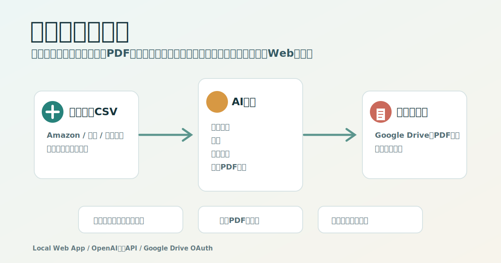
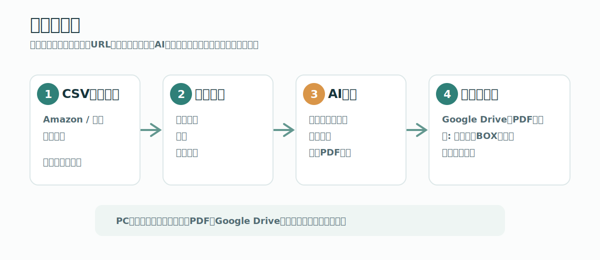

# 取説ライブラリ



購入履歴CSVから、家電・家具・工具・子ども用品・健康器具・車用品・ソフトウェアなどの **取扱説明書ライブラリ** を作るローカルWebアプリです。

前回のスプレッドシート中心案は廃止し、登録体験を中心に作り直しました。Amazon、楽天、メルカリなどの購入履歴CSVを取り込み、登録したい商品だけ選び、AIでメーカー・型番・カテゴリを補完し、公式PDF候補を探して保存します。

[](LICENSE)

## できること



* 購入履歴CSVをアップロードして登録候補を作る
* CSVがない場合は、購入履歴ページからコピーしたテキストを貼り付けて候補化する
* 登録する商品、不要な商品、後で確認する商品を仕分ける
* OpenAI互換APIで商品情報を補完する
* DeepSeekなど、OpenAI以外のLLM APIも設定可能
* 公式サイト優先で取扱説明書PDF候補を探索する
* PDFをGoogle Driveへ保存する
* Google Drive未接続時はローカルに一時保存する
* 紙マニュアルの保管先を「カテゴリ別ボックス＋連番」で自動作成する
* LAN内のスマホから登録済みライブラリを閲覧する

## 使い方

### 1. インストール

```bash
npm install
```

### 2. 起動

```bash
npm run dev
```

PCでは次を開きます。

```text
http://localhost:5173
```

同じLAN内のスマホから見る場合は、PCのローカルIPアドレスを使います。

```text
http://PCのIPアドレス:5173
```

### 3. 購入履歴を取り込む

`購入履歴Inbox` で購入元を選び、CSVをアップロードします。

サンプルCSV:

```text
examples/purchase-history-sample.csv
```

Amazonの公式データリクエストは時間がかかる場合があるため、普段は次の方法を推奨します。

```text
Amazon / 楽天の購入履歴ページを開く
↓
注文カード周辺を範囲選択してコピー
↓
アプリの「購入履歴ページを貼り付け」に貼る
↓
「貼り付けから取り込む」
```

この方法なら、公式CSVの発行を待たずに候補作成を始められます。

### 4. 登録候補を確認する

商品ごとに次を選びます。

```text
登録する
不要
後で確認
```

### 5. AI補完とPDF探索

候補詳細で次を実行します。

```text
AI補完
候補を探す
選択したPDFを保存して登録
```

LLM APIキー未設定でも、CSV内のメーカー・型番・カテゴリや商品名から最低限の推定を行います。

## LLM設定

`設定 > LLM設定` でOpenAI互換APIを指定できます。

DeepSeekを使う例:

```text
Provider名: DeepSeek
API Base URL: https://api.deepseek.com/v1
Model Name: deepseek-chat
API Key: 自分のAPIキー
```

APIキーは `.manual-library/settings.json` に保存され、Gitには入りません。

## Google Drive設定

`設定 > Google Drive` にOAuthクライアント情報を入れます。

```text
OAuth Client ID
OAuth Client Secret
Redirect URI
Driveルートフォルダ名
```

標準のRedirect URI:

```text
http://localhost:5174/api/google/oauth/callback
```

Google Driveにログインすると、登録時にPDFがDriveへ保存されます。未ログインの場合は `.manual-library/archive/` にローカル保存します。

Drive保存イメージ:

```text
Google Drive/
└ 取扱説明書ライブラリ/
   └ キッチン家電/
      └ P0001_Panasonic_食器洗い乾燥機_NP-TZ300-W/
         └ 取扱説明書_取扱説明書.pdf
```

## 紙マニュアル

紙マニュアルは、カテゴリ別ボックス＋連番で管理します。

```text
キッチン家電 BOX-01 #001
工具 BOX-06 #003
子ども用品 BOX-07 #014
```

登録済みライブラリにはこの保管先も表示されるため、スマホから紙の場所を確認できます。

## データ保存場所

ローカルデータは次に保存します。

```text
.manual-library/
├ db.json
├ settings.json
├ google-tokens.json
└ archive/
```

このフォルダは `.gitignore` 済みです。

## ファイル構成

```text
client/              React UI
server/              Express API
server/services/     CSV、LLM、PDF探索、Google Drive
examples/            サンプルCSV
docs/                仕様と運用メモ
legacy/apps-script/  旧Apps Script版
```

## 現在のMVP範囲

* ローカルPCで動くWebアプリ
* CSV取り込み
* 登録候補レビュー
* LLM補完
* 公式PDF候補探索
* Google Drive / ローカル保存
* LAN内スマホ閲覧

クラウド公開、バーコード読み取り、購入サイトへの自動ログイン、保証期限通知は後続バージョンで扱います。

## ライセンス

[MIT License](LICENSE)
